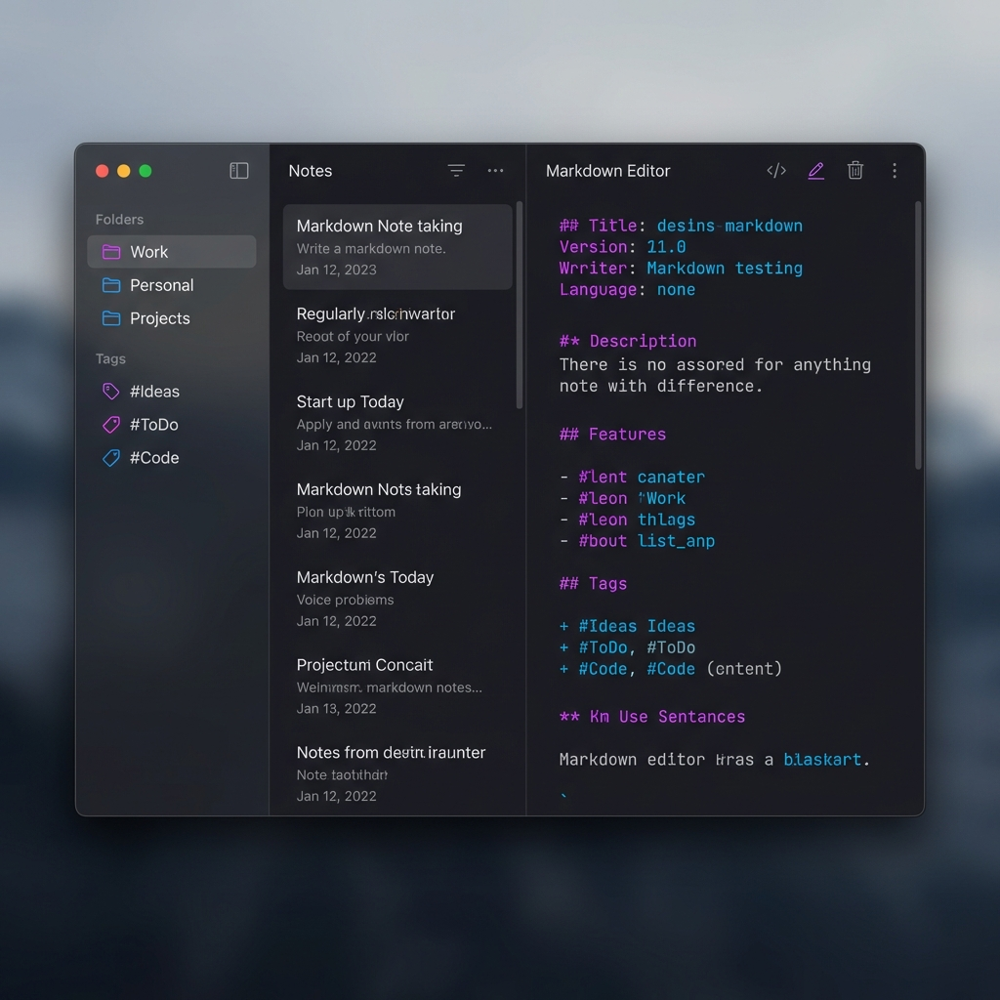

# NoDaysIdle MDNotes 📝

> A beautiful, modern, and efficient Markdown note-taking application built for those who never stay idle.



## 🚀 Overview

**NoDaysIdle MDNotes** is a sleek, dark-themed note-taking application designed for productivity and focus. Built with performance and aesthetics in mind, it provides a distraction-free environment for writing, organizing, and managing your thoughts.

Whether you're a developer, writer, or student, MDNotes offers the perfect balance between simplicity and power.

## ✨ Features

- **📂 Smart Organization**: deeply nested folders to keep your projects structured.
- **🏷️ Flexible Tagging**: Tag your notes for easy cross-referencing and discovery.
- **⚡ Quick Search**: Instant Command Palette (`Cmd+K`) to find any note in milliseconds.
- **✍️ Rich Markdown Editor**: Full syntax highlighting, live preview feel, and comfortable typography.
- **🌗 Beautiful UI**: A carefully crafted dark mode with vibrant accents and glassmorphism effects.
- **🔒 Privacy First**: Your notes live locally on your machine.

## 🛠️ Tech Stack

Built with cutting-edge web technologies wrapped in a lightweight desktop runtime:

- **[Tauri](https://tauri.app/)**: For a tiny memory footprint and native performance.
- **[React 19](https://react.dev/)**: For a snappy, responsive user interface.
- **[TypeScript](https://www.typescriptlang.org/)**: ensuring type safety and code reliability.
- **[TailwindCSS](https://tailwindcss.com/)**: For beautiful, modern styling.

## 🏁 Getting Started

### Prerequisites

- Node.js (v18 or later)
- Rust (for Tauri development)

### Installation

1. Clone the repository:

   ```bash
   git clone https://github.com/salvadalba/nodaysidle-MDNote.git
   cd nodaysidle-MDNote
   ```

2. Install dependencies:

   ```bash
   npm install
   ```

3. Run the development server:

   ```bash
   npm run tauri dev
   ```

4. Build for production:

   ```bash
   npm run tauri build
   ```

## ⌨️ Shortcuts

| Key | Action |
| --- | --- |
| `Cmd/Ctrl + N` | Create New Note |
| `Cmd/Ctrl + K` | Open Search Palette |
| `Cmd/Ctrl + ,` | Open Settings |

## 🤝 Contributing

Contributions are welcome! Please feel free to submit a Pull Request.

---

<p align="center">
  Made with ❤️ by <a href="https://github.com/salvadalba">NDI</a>
</p>
